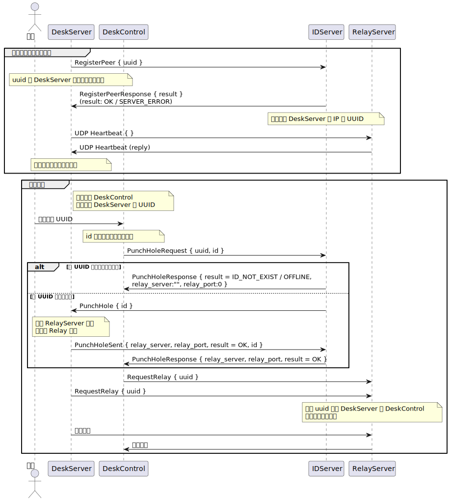
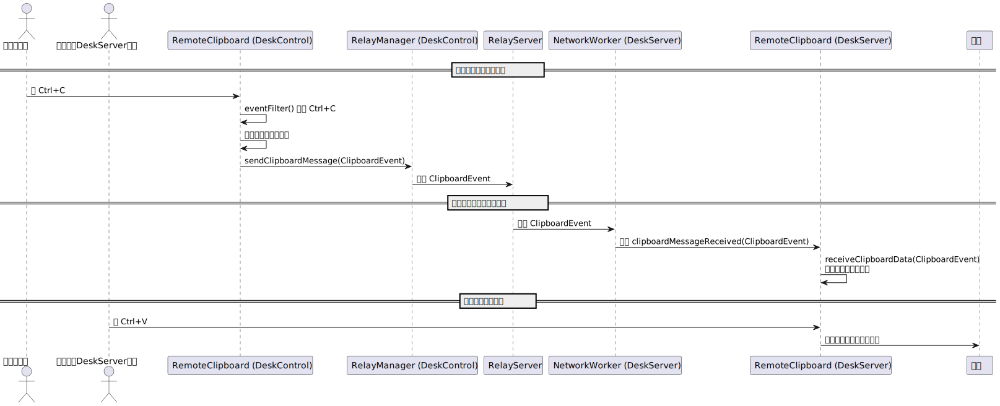

# SimpleRustDesk

SimpleRustDesk 是一个远程桌面控制系统示例项目，参考 RustDesk 的设计思想，展示了如何构建一个完整的远程控制框架。系统通过信令交互和数据中继，实现被控端与控制端之间的远程连接与数据传输，主要包含以下模块：

## 框架概述

- **IDServer（信令服务器）**  
  信令服务器作为系统的中枢，主要负责管理被控端的注册与状态交换。控制端无需注册，只需手动输入目标设备 ID 发起连接请求。

- **DeskServer（被控端）**  
  被控端启动后会向 IDServer 注册自己的在线信息，供远程控制使用。同时，DeskServer 会检测 RelayServer 的在线状态，以确保中继服务可用。被控端支持分布式部署，无需自行启动中继模块。

- **DeskControler（控制端）**  
  控制端通过手动输入目标被控端的 ID 发起连接请求。一旦确认连接，控制端依赖 RelayServer 进行数据中继，从而实现远程控制操作。

- **RelayServer（中继服务器）**  
  RelayServer 提供数据转发服务，确保远程控制过程中的数据能够顺畅传输。
  
## 系统 UML 图

## 鼠标键盘控制 UML 图

## 文件传输-从控制端复制 UML 图

## 文件传输-从被控制端复制 UML 图

## 注意事项

- 本项目为示例性质，主要展示远程控制系统的整体架构和基本实现。

## 贡献

欢迎各位开发者通过提交 PR 或 issue 来改进和扩展本项目。如有疑问或建议，请在 GitHub 上联系项目维护者。

## TODO

- **支持加密传输**  
  引入 SSL/TLS 或其他加密算法，以保障远程控制过程中的数据安全。
  
- **键盘鼠标控制**  
  - [x] 已实现：捕获与转发键盘和鼠标事件，实现完整流畅的远程桌面控制。
  
- **文件传输**  
  - [x] 已实现：增加文件上传和下载模块，方便用户在远程会话中传输所需文件。

## 许可

本项目采用 [MIT 许可](LICENSE)。
